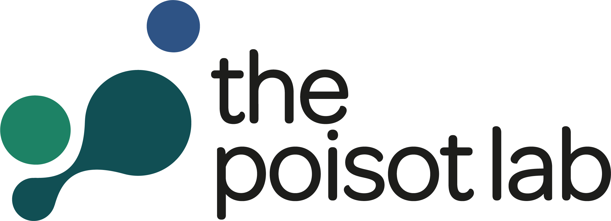
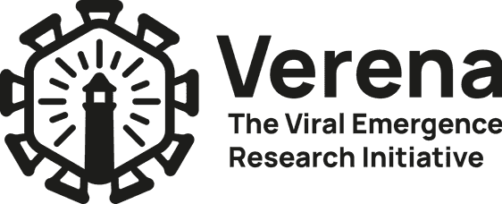

## Hi there! Salut!

I am a postdoctoral fellow in biology at the University of Montreal, working on the usability of biodiversity indicators for monitoring One Health actions. In my PhD, I developed mathematical models of species interactions, notably host-parasite, predator-prey and plant-pollinator interactions. With my models, I aim to improve our understanding of the ecological drivers of species interactions, in both aquatic and terrestrial environments, and predict the structure of ecological networks both locally and regionally.

I use he/him pronouns.  

------------------------------------------------------------------------

## Education

 Postdoc in biology, working in One Health (since 2025)\
*Université de Montréal, Canada*\

 PhD in computational ecology (2019-24)\
*Université de Montréal, Canada*\

------------------------------------------------------------------------

## What's keeping me busy now 

 I'm currently looking at the link between biodiversity indicators and One Health. Stay tuned!

 I'm also learning how to teach to become an ecology professor.

------------------------------------------------------------------------

## Current affiliations 

[{width=125 fig-align="left"}](https://poisotlab.io/)

[{width=125 fig-align="left"}](https://bios2.usherbrooke.ca/)

[{width=110 fig-align="left"}](https://qcbs.ca/)

[{width=110 fig-align="left"}](https://www.viralemergence.org/) 

