# Publications

##### 13. A paleoecological trophic network model of the Early Ordovician Lower Fezouata Shale (Morocco) fossil fauna
::: {.column-margin}
[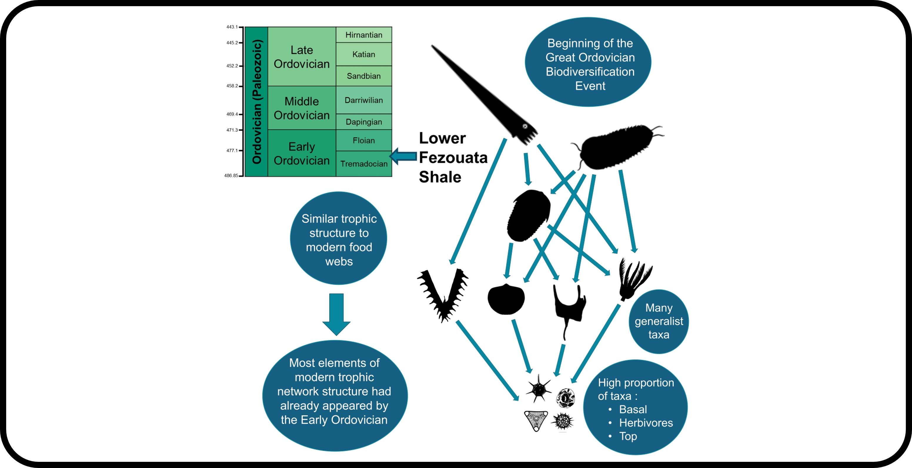{height=220, width=220}](https://doi.org/10.1016/j.isci.2026.116819)
:::

Soucy, C.P., **Banville, F.**, Beasley, E., Lefebvre, B., Gutiérrez-Marco, J.C., Poisot, T., & Cameron, C.B. (2026)\
*iScience*\
[ article](https://doi.org/10.1016/j.isci.2026.116819),
[ repo](https://github.com/FrancisBanville/paleo-foodwebs)

 

##### 12. Impersonating predators and prey to study trophic interactions through real-life simulations
::: {.column-margin}
[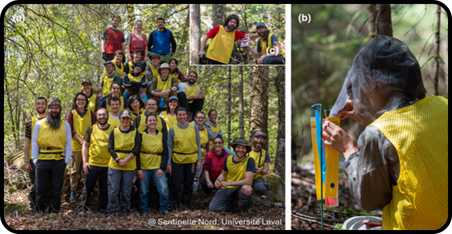{height=220, width=220}](http://doi.org/10.1111/2041-210x.70180 )
:::

Bolduc, D., Dulude-de Broin, F., Bergeron, G., Villeneuve, C., Weiss-Blais, M., Couloigner, C., Dubourg, R., Fraser-Franco, M., **Banville, F.**, Moisan, L., Montiglio, P.-O., Fortin, D., Thibault, F., Allard, A., Gaudreau-Rousseau, C., Roca, I., Durand, A., Massé, C., Barreau, E., … Legagneux, P. (2025)\
*Methods in Ecology and Evolution*\
[ article](http://doi.org/10.1111/2041-210x.70180 ),
[ repo](https://github.com/gabrielbouleau/TrophIE_pub)

 

##### 11. Deciphering probabilistic species interaction networks

::: {.column-margin}
[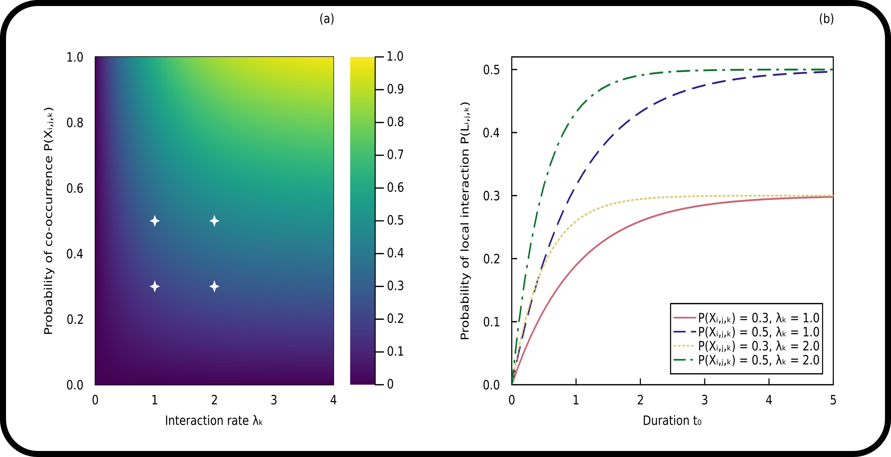{height=220, width=220}](https://doi.org/10.1111/ele.70161)
:::

**Banville, F.**, Strydom, T., Blyth, P., Brimacombe, C., Catchen, M.D., Dansereau, G., Higino, G., Malpas, T., Mayall, H., Norman, K., Gravel, D., & Poisot, T. (2025)\
*Ecology Letters*\
[ article](https://doi.org/10.1111/ele.70161),
[ repo](https://github.com/FrancisBanville/ProbabilisticSpeciesInteractionNetworks)

 

##### 10. Graph embedding and transfer learning can help predict potential species interaction networks despite data limitations

::: {.column-margin}
[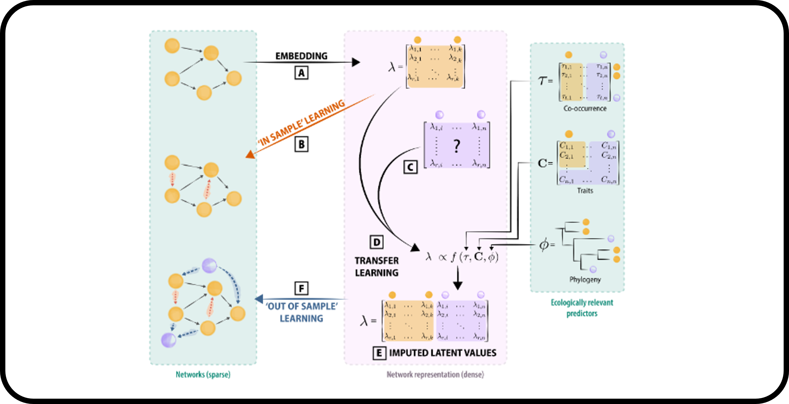{height=220, width=220}](https://doi.org/10.1111/2041-210X.14228)
:::

Strydom, T., Bouskila, S., **Banville, F.**, Barros, C., Caron, D., Farrell, M.J., Fortin, M.-J., Mercier, B., Pollock, L.J., Runghen, R., Dalla Riva, G.V., & Poisot. T. (2023)\
*Methods in Ecology and Evolution*\
[ article](https://doi.org/10.1111/2041-210X.14228),
[ repo](https://github.com/PoisotLab/ms_metaweb_perspectives)

 

##### 9. What constrains food webs? A maximum entropy framework for predicting their structure with minimal biases

::: {.column-margin}
[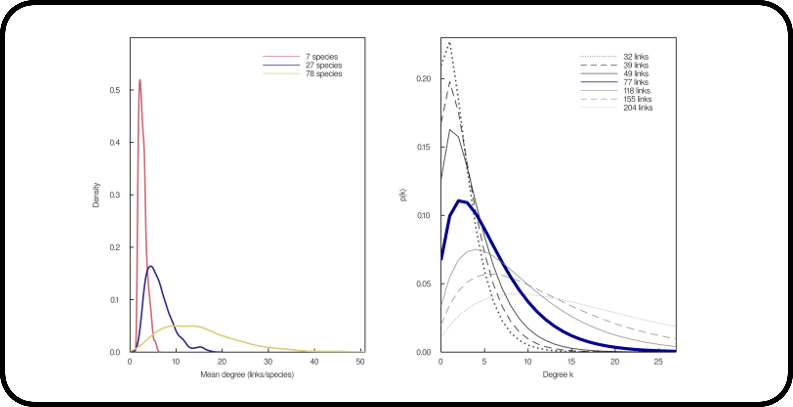{height=220, width=220}](https://arxiv.org/abs/2210.03190)
:::

**Banville, F.**, Gravel, D., & Poisot, T. (2023)\
*PLoS Computational Biology*\
[ article](https://journals.plos.org/ploscompbiol/article?id=10.1371/journal.pcbi.1011458),
[ repo](https://github.com/FrancisBanville/ms_maxent_networks)

 

##### 8. Mismatch between IUCN range maps and species interactions data illustrated using the Serengeti food web

::: {.column-margin}
[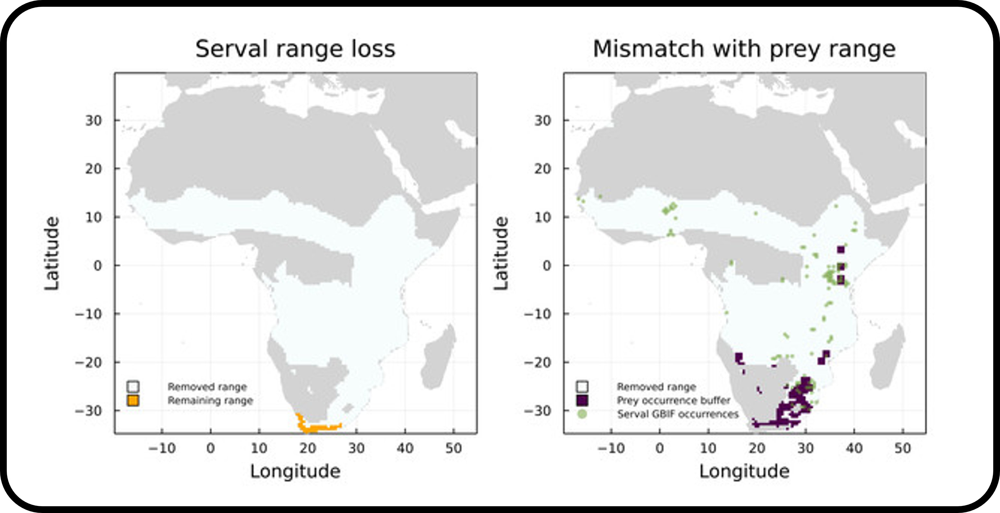{height=220, width=220}](https://doi.org/10.7717/peerj.14620)
:::

Higino, G.T., **Banville, F.**, Dansereau, G., Muñoz, N.R.F., Windsor, F., & Poisot, T. (2023)\
*PeerJ*\
[ article](https://doi.org/10.7717/peerj.14620), 
[ repo](https://github.com/graciellehigino/ms_range_interactions)

 

##### 7. Ten simple rules for teaching yourself R

::: {.column-margin}
[{height=220, width=220}](https://doi.org/10.1371/journal.pcbi.1010372)
:::

Lawlor, J., **Banville, F.**, Forero-Muñoz, N.R.F, Hébert, K., Martínez-Lanfranco, J.A., Rogy, P., & MacDonald, A.A.M. (2022)\
*PLOS Computational Biology*\
[ article](https://doi.org/10.1371/journal.pcbi.1010372)

 
 

##### 6. Food web reconstruction through phylogenetic transfer of low-rank network representation

::: {.column-margin}
[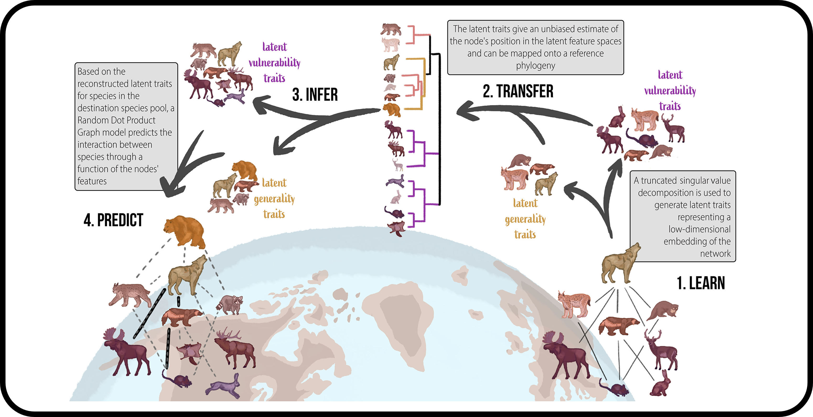{height=220, width=220}](https://doi.org/10.1111/2041-210X.13835)
:::

Strydom, T., Bouskila, S., **Banville, F.**, Barros, C., Caron, D., Farrell, M.J., Fortin, M.-J., Hemming, V., Mercier, B., Pollock, L.J., Runghen, R., Dalla Riva, G.V., & Poisot, T. (2022)\
*Methods in Ecology and Evolution*\
[ article](https://doi.org/10.1111/2041-210X.13835),
[ code repo](https://github.com/PoisotLab/MetawebTransferLearning),
[ article repo](https://github.com/PoisotLab/ms_metaweb_transfer)

 

##### 5. A roadmap towards predicting species interaction networks (across space and time)

::: {.column-margin}
[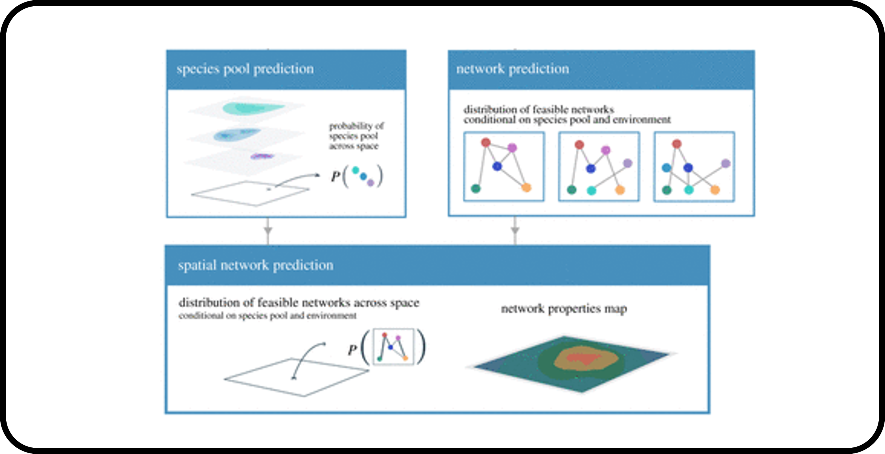{height=220, width=220}](https://doi.org/10.1098/rstb.2021.0063)
:::

Strydom, T., Catchen, M.D., **Banville, F.**, Caron, D., Dansereau, G., Desjardins-Proulx, P., Forero-Muñoz, N.R., Higino, G., Mercier, B., Gonzalez, A., Gravel, D., Pollock, L., & Poisot, T. (2021)\
*Philosophical Transactions of the Royal Society B: Biological Sciences*\
[ article](https://doi.org/10.1098/rstb.2021.0063),
[ code repo](https://github.com/PoisotLab/NetworkLearningIllustration),
[ article repo](https://github.com/PoisotLab/ms_network_prediction)

 

##### 4. Computers can help us find raccoons and other living creatures

::: {.column-margin}
[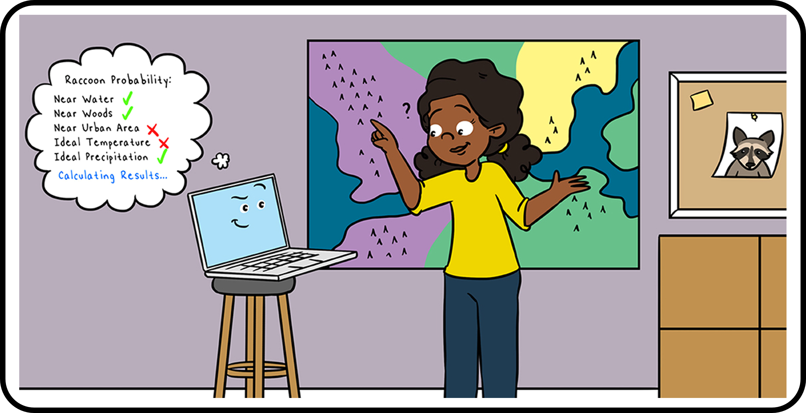{height=220, width=220}](https://kids.frontiersin.org/articles/10.3389/frym.2021.595275)
:::

Higino G., Forero N., **Banville, F.**, Dansereau, G., & Poisot, T. (2021)\
*Front. Young Minds*\
[ article](https://kids.frontiersin.org/articles/10.3389/frym.2021.595275), 
[ repo](https://github.com/PoisotLab/ms_frontiers_kids)

 
 

##### 3. Mangal.jl and EcologicalNetworks.jl : Two complementary packages for analyzing ecological networks in Julia

::: {.column-margin}
[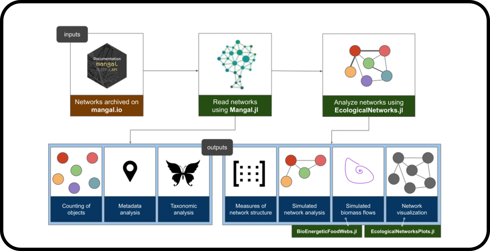{height=220, width=220}](https://doi.org/10.21105/joss.02721)
:::

**Banville, F.**, Vissault, S., & Poisot, T. (2021)\
*Journal of Open Source Software*\
[ article](https://doi.org/10.21105/joss.02721), 
[  repo](https://github.com/PoisotLab/EcologicalNetworks.jl/tree/joss-article-review1),
[ Mangal.jl](https://github.com/PoisotLab/Mangal.jl),
[ EcologicalNetworks.jl](https://github.com/PoisotLab/EcologicalNetworks.jl) 

 

##### 2. \[Re\] Chaos in a three-species food chain

::: {.column-margin}
[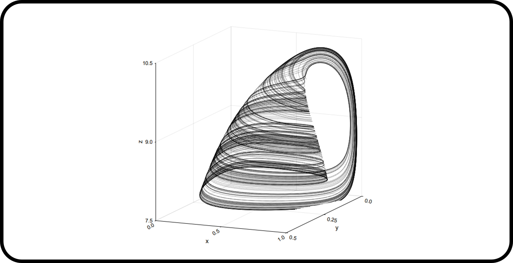{height=220, width=220}](https://doi.org/10.5281/zenodo.4022518)
:::

Dansereau, G., **Banville, F.**, Basque, E., MacDonald, A., & Poisot, T. (2020)\
*ReScience C*\
[ article](http://rescience.github.io/bibliography/Dansereau_2020.html), 
[ repo](https://github.com/BIO6032/2019_replication_HastingsPowell_1991/tree/v1.0.0)

 
 

##### 1. Revisiting the links-species scaling relationship in food webs

::: {.column-margin}
[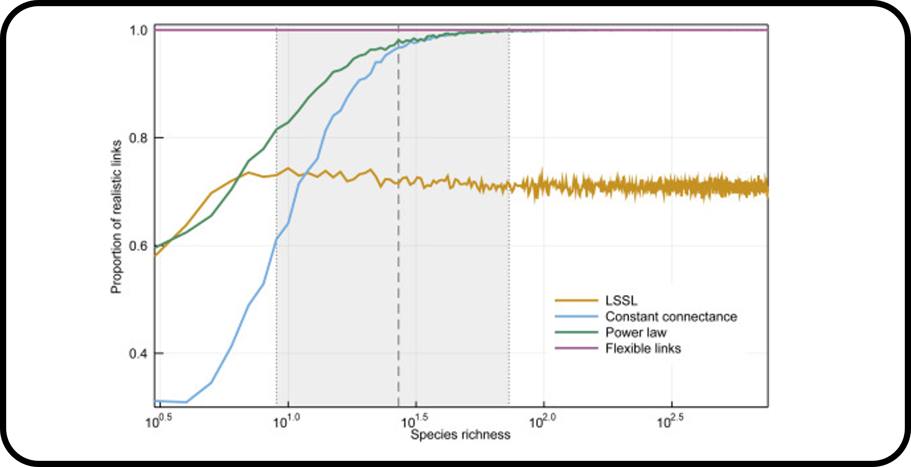{height=220, width=220}](https://doi.org/10.1016/j.patter.2020.100079)
:::

MacDonald, A., **Banville, F.**, & Poisot, T. (2020)\
*Patterns*\
[ article](https://doi.org/10.1016/j.patter.2020.100079), 
[ repo](https://github.com/PoisotLab/ms_straight_lines)

 
 

# Preprints

##### 3.  The Global Biodiversity Framework supports global assessment of One Health actions

::: {.column-margin}
[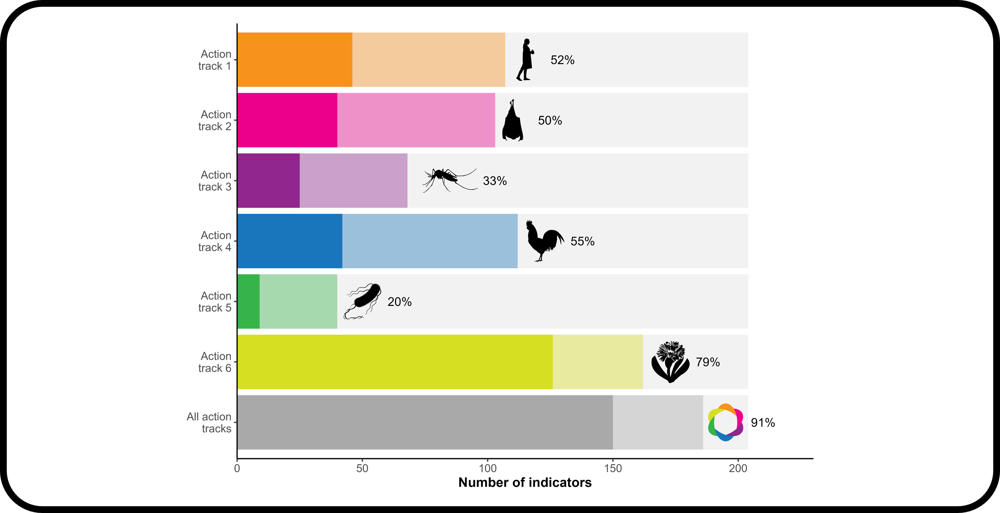{height=220, width=220}](https://ecoevorxiv.org/repository/view/13028/)
:::

**Banville, F.**, Burnel, C., Carlson, C.J., Eiffener, E., Munoz Acevedo, G., Paz, A., & Poisot, T. (2026)\
*EcoEvoRxiv*\
[ article](https://ecoevorxiv.org/repository/view/13028/), 
[ code repo](https://github.com/FrancisBanville/BiodiversityForHealth),
[ article repo](https://github.com/FrancisBanville/ms_biodiversity_for_health)

 

##### 2. A protocol for biodiversity-informed wildlife disease surveillance

::: {.column-margin}
[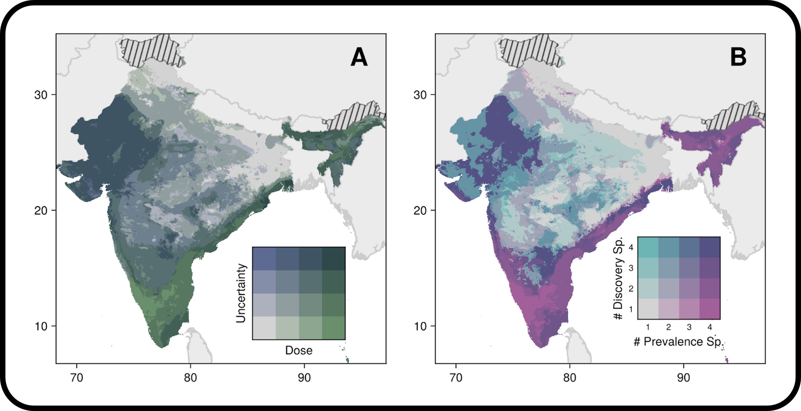{height=220, width=220}](https://ecoevorxiv.org/repository/view/11160/)
:::

Catchen, M.D., **Banville, F.**, Boutin, A.C., Brookson, C.B., Carlson, C.J., Dansereau, G., Gibb, R., Houle, M., Kaza, B., Robertson, H., Simons, D., Seifert, S., & Poisot, T. (2025)\
*EcoEvoRxiv*\
[ article](https://ecoevorxiv.org/repository/view/11160/), 
[ repo](https://github.com/gottacatchenall/OptimalSamplingBiosurveillance)

 

##### 1. Tracking community change via network coherence

::: {.column-margin}
[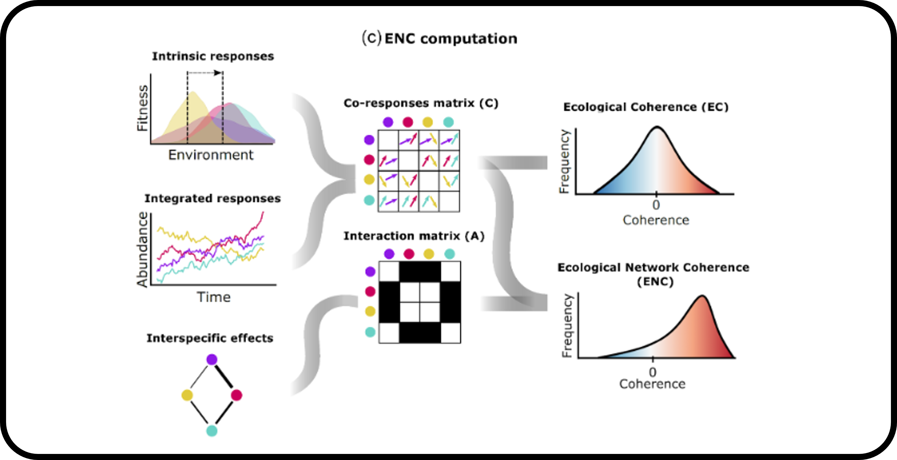{height=220, width=220}](https://doi.org/10.1101/2025.11.04.686602)
:::

Fuster-Calvo, A., Higino, G.T., Parent, C., Caron, D., **Banville, F.**, Massol, F., Blanchet, F.G., Hebert, K., Pollock, L., Maiorano, L., Guimaraes, P.R., Silva, P., Thuiller, W., & Gravel, D. (2025)\
*bioRxiv*\
[ article](https://doi.org/10.1101/2025.11.04.686602) 

